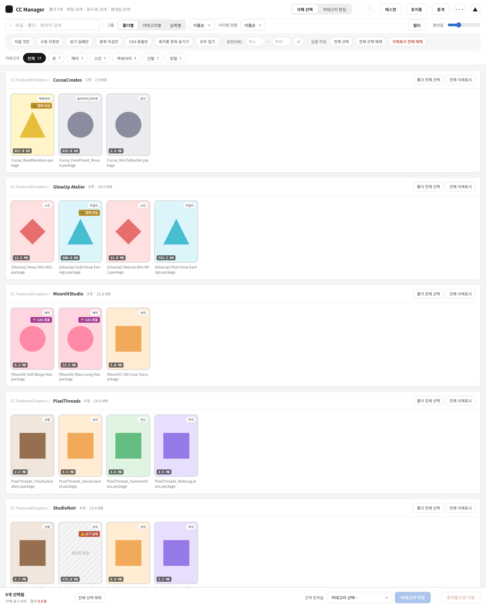
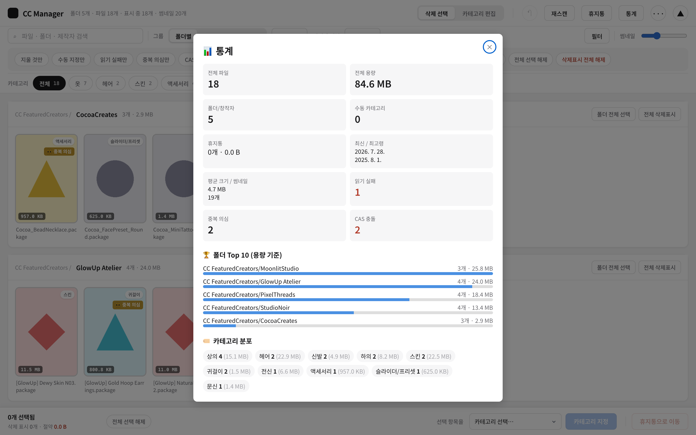
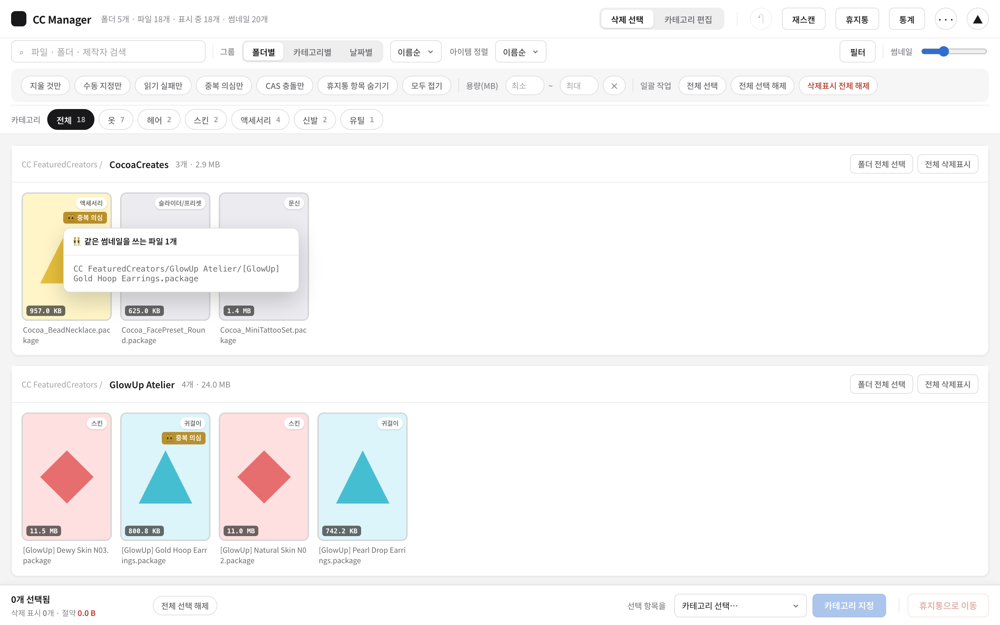

# Sims 4 CC Manager

심즈4 CC(커스텀 콘텐츠) 정리 도구.

`Mods/` 폴더의 `.package` 파일에서 썸네일을 뽑아 브라우저 갤러리로 보여주고,
필요 없는 항목을 안전하게 골라 정리하거나, 중복·손상·충돌 파일을 찾아낼 수 있게 해준다.
외부 의존성 없이 파이썬 표준 라이브러리만으로 동작하는 단일 파일 앱.



<sub>※ 스크린샷은 실제 CC나 창작자 이름이 아닌 샘플 데이터로 찍은 것.</sub>

<table>
<tr>
<td width="50%"><br><sub>통계 대시보드</sub></td>
<td width="50%"><br><sub>중복 의심 항목 클릭 → 겹치는 파일 목록</sub></td>
</tr>
</table>

## 요구사항

- Python 3.8+ (추가 설치 불필요 — 표준 라이브러리만 사용)
- **macOS**에서 개발/테스트됨. Windows에서도 동작하도록 짜여있고(경로 처리, 앱 데이터
  저장 위치 모두 OS별로 분기) `CC Manager.bat` 런처도 있지만, 실제 Windows 환경에서
  검증된 적은 아직 없음 — 문제 있으면 [이슈](https://github.com/BaeGayeon/sims4-cc/issues)로 알려주면 좋음.

## 실행

```bash
python3 sims_cc_manager.py
```

또는 더블클릭: macOS는 `CC Manager.command`, Windows는 `CC Manager.bat`.
`http://localhost:8765` 가 자동으로 열린다.

개발 중엔 `CC Manager (Dev).command` (macOS 전용) — 파일 저장할 때마다 문법 체크 후 자동 재시작.

Mods 폴더는 `~/Documents/Electronic Arts/The Sims 4/Mods` 또는
`~/Games/Electronic Arts/The Sims 4/Mods` 를 자동으로 찾는다. 못 찾으면:

```bash
export SIMS4_MODS_PATH="/원하는/경로/Mods"
```

또는 앱 안 `⋯ → 설정` 에서 경로를 지정하면 저장과 동시에 자동으로 재스캔된다.

## 주요 기능

**스캔 & 분류**
- `.package` 파일 DBPF v2 인덱스 파싱 → CAS 썸네일(JPEG/PNG) 추출
- CASP 리소스 파싱 + 파일명 휴리스틱으로 카테고리 자동 분류
- 수동 카테고리 오버라이드 (재스캔해도 유지) + JSON 백업/복원
- 재스캔 시 이전 스캔과 비교해 "신규 N개 · 제거 M개" 요약 표시

**갤러리 UI**
- 폴더별 / 카테고리별 / 날짜별 그룹, 다중 키워드 검색(+최근 검색 기록), 카테고리·용량 필터
- 클릭으로 확대(라이트박스), 여러 장 있는 썸네일은 좌우로 넘겨보기
- 다크모드, 반응형 레이아웃, Cmd+클릭/드래그 다중 선택, 카테고리 chip으로 드래그해서 일괄 지정

**라이브러리 정리**
- 안전한 삭제: 앱 데이터 폴더 안 `trash/` 로 이동 (복원 가능, 위치는 [데이터 저장 위치](#데이터-저장-위치) 참고)
- Cmd+Z 되돌리기, 다중 선택 + 일괄 카테고리 지정
- 읽을 수 없는(손상된) `.package` 감지 및 표시
- 같은 썸네일을 쓰는 중복 설치 의심 항목 탐지 — 클릭하면 겹치는 파일 목록 + 위치 이동
- 같은 CAS 리소스를 두 파일이 동시에 정의하는 실제 충돌 탐지 (로드 순서에 따라 조용히 덮어써지는 경우)

**통계**
- 전체 용량/파일 수, 창작자·카테고리별 분포, 최신/최고령 파일, 평균 크기 등

## 데이터 저장 위치

OS별 표준 사용자 데이터 폴더 밑에 `Sims4CCManager/` 로 저장된다:

- macOS: `~/Library/Application Support/Sims4CCManager/`
- Windows: `%APPDATA%\Sims4CCManager\`
- Linux: `~/.local/share/Sims4CCManager/`

```
Sims4CCManager/
├── config.json                ← Mods 경로 설정
├── manifest.json               ← 스캔 결과 캐시
├── thumbs/                     ← 추출된 썸네일
├── category_overrides.json     ← 수동 카테고리 지정
├── trash_manifest.json         ← 휴지통 메타데이터
└── trash/                      ← 휴지통으로 이동된 파일 (복원 가능)
```

Mods 폴더 자체는 스캔만 하고 건드리지 않는다 — 삭제해도 파일은 위 `trash/` 로 옮겨질 뿐, 완전
삭제(휴지통 비우기)를 하기 전까진 언제든 복원 가능하다.

## 알아두면 좋은 것

- 로컬 전용 서버(`localhost:8765`)다. 외부에서 접근되지 않고, 브라우저 탭을 닫아도 터미널에서
  `Ctrl+C` 해야 서버가 완전히 종료된다.
- 심즈4 게임 폴더를 설정에 넣어도 안의 `Mods`를 자동으로 찾아 쓴다.
